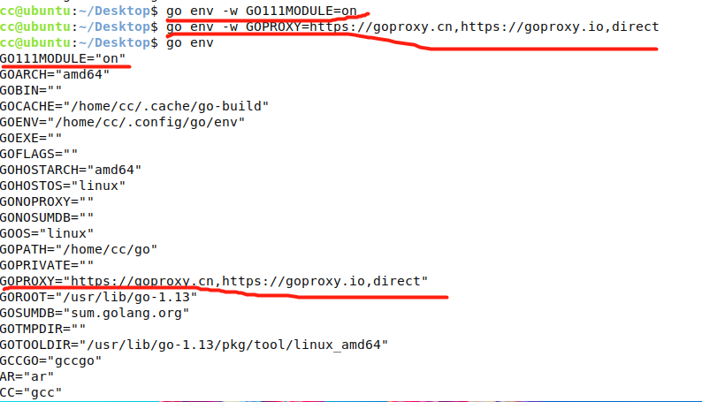

# 简介/安装

## 简介

### Golang是什么？
Go（又称Golang）是Google开发的一种静态强类型、编译型、并发型，并具有垃圾回收功能的编程语言。
罗伯特·格瑞史莫（Robert Griesemer），罗勃·派克（Rob Pike）及肯·汤普逊（Ken Thompson）于2007年9月开始设计Go，稍后Ian Lance Taylor、Russ Cox加入项目。Go是基于Inferno操作系统所开发的。Go于2009年11月正式宣布推出，成为开放源代码项目，并在Linux及Mac OS X平台上进行了实现，后来追加了Windows系统下的实现。在2016年，Go被软件评价公司TIOBE 选为“TIOBE 2016 年最佳语言”。

### Google创造Golang的原因
1. 计算机硬件技术更新频繁,性能提高很快。目前主流的编程语言发展明显落后于硬件,不能合理利用**多核多CPU**的优势提升软件系统性能
2. 软件系统复杂度越来越高,维护成本越来越高,目前**缺乏一个足够简洁高效**的编程语言。
3. 企业运行维护很多c/c++的项目,c/c++程序运行速度虽然很快,但是编译速度很慢,同时还存在**内存泄漏**的一些列的困扰需要解决。

### Golang的语言特点
Go语言，保证了既能达道**静态编译语言的安全和性能**，又达道了**动态语言开发维护的高效率**，`Go相当于: GO = C + Python` ,说明Go语言既有C静态语言程序运行效率,又能达道Python动态语言的快速开发。

::: tip Go语言特点很多 以下简单总结个人理解的特点：
:::
1. **更丰富的内置类型** ，Go从C语言中继承了很多概念，包括表达式，流程控制，基础数据类型，**指针**等等
2. **自动垃圾回收**，垃圾回收机制，内存自动回收，不需要开发人员管理
3. **天然并发**，Go语言从语言层面支持并发
4. **函数多返回值**
5. **静态编译**
6. **错误处理**，说实话 没感觉Go错误处理多好用，还是喜欢**try-catch-finally**
7. **包管理**，用于组织程序结构，Go语言的一个文件都要归属于一个包，而不能单独存在。


## Windows下安装Go
1. 下载 golang 压缩包 [Golang官网](https://golang.google.cn/dl/)


2. 打开下载的 golang安装包  一直点下一步  **可以设置指定安装目录** 我这里默认安装到:`C:\Program Files\Go`


输入 `go version` 检查是否安装成功 **出现版本号 表示安装 成功**

3. 查看 GOPATH 和开启go mod
+ GOPATH默认的 工作空间
+ go mod 是包管理  **开启go mod：** `go env -w GO111MODULE=on`  **开启go mod 代理 (外网的原因，需要使用代理)：** `go env -w GOPROXY=https://goproxy.cn,https://goproxy.io,direct`


4. 建立Go的工作空间（workspace，也就是GOPATH环境变量指向的目录）

 GO代码必须在工作空间内。工作空间是一个目录，其中包含三个子目录：
+ src ---- 里面每一个子目录，就是一个包。包内是Go的源码文件
+ pkg ---- 编译后生成的，包的目标文件
+ bin ---- 生成的可执行文件。

我的**GOPATH**在`C:\Users\admin\go`目录下, 在**GOPATH目录下**建立一个名为dome(可以不是dome, 任意名字都可以)的文件夹，
然后再建立三个子文件夹(子文件夹名必须为src、pkg、bin)。如下图：


5. 代码实测（测试go是否安装成功）


## linux下安装Go

### 命令安装
::: warning 命令安装 会出现 go版本不是最新的
:::
作者使用系统：**ubuntu20.04 系统**
1. 输入安装命令 `sudo apt-get install golang`


2. 输入`go version` 和 `go` 出现如下图表示安装成功


3. 输入`go env` 查看  GOROOT(代表go安装目录) GOPATH(代表工作目录)


4. 开启go mod   **开启go mod：** `go env -w GO111MODULE=on`  **开启go mod 代理 (外网的原因，需要使用代理)：** `go env -w GOPROXY=https://goproxy.cn,https://goproxy.io,direct`



5. 建立Go的工作空间（workspace，也就是GOPATH环境变量指向的目录）

 GO代码必须在工作空间内。工作空间是一个目录，其中包含三个子目录：
+ src ---- 里面每一个子目录，就是一个包。包内是Go的源码文件
+ pkg ---- 编译后生成的，包的目标文件
+ bin ---- 生成的可执行文件。

我的**GOPATH**在`C:\Users\admin\go`目录下, 在**GOPATH目录下**建立一个名为dome(可以不是dome, 任意名字都可以)的文件夹，
然后再建立三个子文件夹(子文件夹名必须为src、pkg、bin)。如下图：


6. 代码实测（测试go是否安装成功）


7. 卸载golang  **`sudo apt-get --purge remove golang*`**

### 源码安装
1. 下载 golang 压缩包 [Golang官网](https://golang.google.cn/dl/)


通过 上图找到 下载地址 在 输入 ：**`wget https://golang.google.cn/dl/go1.16.5.linux-amd64.tar.gz`**


2. 解压软件包 到 `/usr/local` 官方推荐目录

**`sudo tar -C /usr/local -xzf go1.16.5.linux-amd64.tar.gz`**


3. 添加 环境变量 `sudo vim /etc/profile`

vim 打开文件 添加
``` sh
export GOPATH=/home/cc/go
export GOROOT=/usr/local/go
export PATH=$PATH:/usr/local/go/bin
export PATH=$PATH:$GOPATH:$GOROOT:/bin
```


在 `source /etc/profile`  更新一下文件

4. 开启go mod   **开启go mod：** `go env -w GO111MODULE=on`  **开启go mod 代理 (外网的原因，需要使用代理)：** `go env -w GOPROXY=https://goproxy.cn,https://goproxy.io,direct`


5. 建立Go的工作空间（workspace，也就是GOPATH环境变量指向的目录）

 GO代码必须在工作空间内。工作空间是一个目录，其中包含三个子目录：
+ src ---- 里面每一个子目录，就是一个包。包内是Go的源码文件
+ pkg ---- 编译后生成的，包的目标文件
+ bin ---- 生成的可执行文件。

我的**GOPATH**在`C:\Users\admin\go`目录下, 在**GOPATH目录下** 建立一个名为dome(可以不是dome, 任意名字都可以)的文件夹，
然后再建立三个子文件夹(子文件夹名必须为src、pkg、bin)。如下图：


6. 代码实测（测试go是否安装成功）


